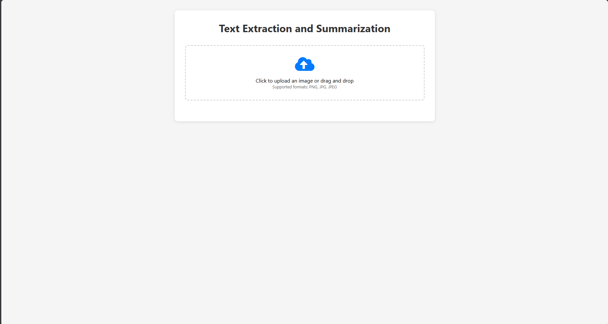
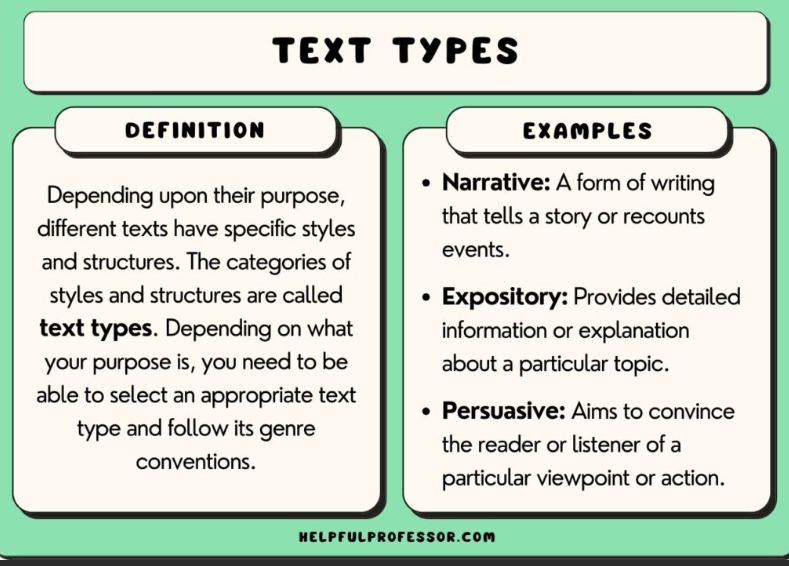
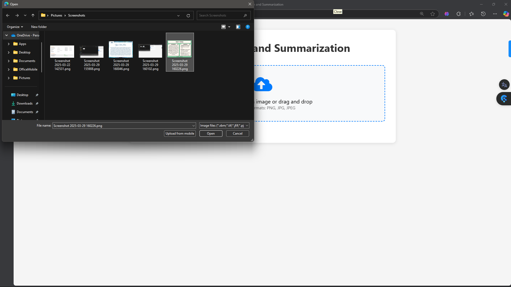
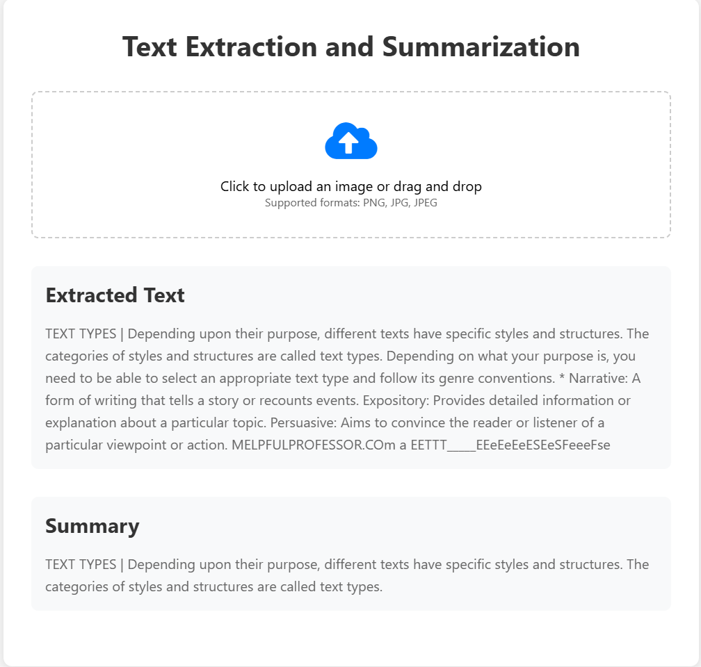

# Image Text Extraction and Summarization

A web application that extracts text from images using OCR (Optical Character Recognition) and generates summaries of the extracted text. The application provides both a web interface and a command-line interface for easy usage.

## Screenshots

### Home Page

*The main interface with drag-and-drop upload functionality*

### Text Extraction

*Example of text extracted from an uploaded image*

### Text Summarization

*Generated summary of the extracted text*

### Error Handling

*Example of error handling when Tesseract is not properly configured*

## Features

- Text extraction from images using Tesseract OCR
- Automatic text summarization
- Modern web interface with drag-and-drop support
- Real-time processing with loading indicators
- Support for various image formats (PNG, JPG, JPEG)
- Error handling and user-friendly messages

## Prerequisites

1. Python 3.7 or higher
2. Tesseract OCR installed on your system
   - For Windows: Download and install from [UB-Mannheim/tesseract](https://github.com/UB-Mannheim/tesseract/wiki)
   - For Linux: `sudo apt-get install tesseract-ocr`
   - For macOS: `brew install tesseract`

## Installation

1. Clone this repository:
   ```bash
   git clone https://github.com/yourusername/image-text-extraction-summarization.git
   cd image-text-extraction-summarization
   ```

2. Install the required Python packages:
   ```bash
   pip install -r requirements.txt
   ```

3. Make sure Tesseract OCR is installed and accessible in your system PATH

## Usage

### Web Interface (Recommended)

1. Run the Flask application:
   ```bash
   python app.py
   ```

2. Open your web browser and navigate to `http://localhost:5000`

3. Upload an image by either:
   - Clicking the upload area and selecting a file
   - Dragging and dropping an image file onto the upload area

4. Wait for the processing to complete

5. View the extracted text and summary

### Command Line Interface

1. Run the script:
   ```bash
   python text_extraction_and_summarization.py
   ```

2. Enter the path to your image when prompted

3. View the extracted text and summary

## Project Structure

- `app.py`: Flask web application
- `text_extraction_and_summarization.py`: Core functionality for text extraction and summarization
- `templates/index.html`: Web interface template
- `requirements.txt`: Python package dependencies
- `uploads/`: Temporary directory for uploaded files (created automatically)

## Dependencies

The project uses the following main dependencies:

- Flask (3.1.0): Web framework
- Pillow (11.1.0): Image processing
- pytesseract (0.3.13): OCR engine wrapper
- Werkzeug (3.1.3): WSGI web application library

For a complete list of dependencies, see `requirements.txt`.

## Tesseract OCR Installation Guide

### Windows
1. Download the installer from [UB-Mannheim/tesseract](https://github.com/UB-Mannheim/tesseract/wiki)
2. Run the installer
3. Add Tesseract to your system PATH:
   - Default path: `C:\Program Files\Tesseract-OCR`
   - Alternative paths: 
     - `C:\Program Files (x86)\Tesseract-OCR`
     - `C:\Tesseract-OCR`

### Linux
```bash
sudo apt-get update
sudo apt-get install tesseract-ocr
```

### macOS
```bash
brew install tesseract
```

## Error Handling

The application includes comprehensive error handling for:
- Missing Tesseract installation
- Invalid image files
- Failed text extraction
- Failed summarization
- File upload issues

## Contributing

Feel free to submit issues, fork the repository, and create pull requests for any improvements.

## License

This project is licensed under the MIT License - see the LICENSE file for details. 